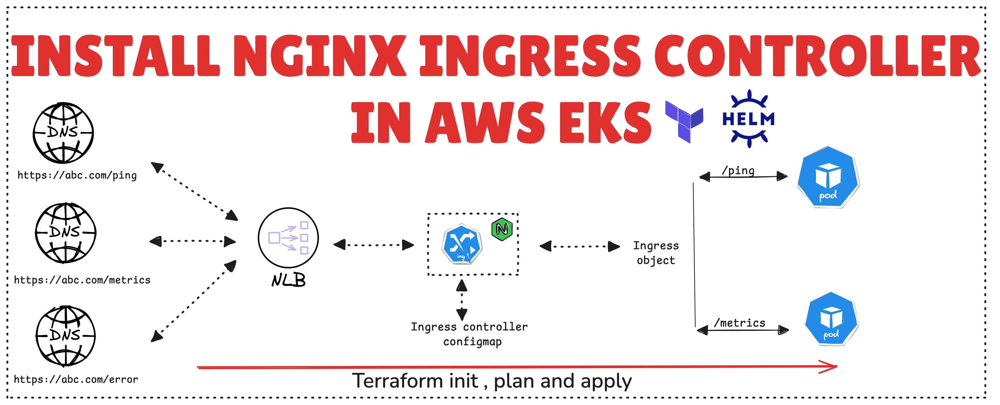

### Lesson 2: Install NGINX Ingress Controller in AWS EKS

This lesson covers the steps to install and configure an NGINX Ingress Controller in your EKS cluster, enabling you to manage external access to your Kubernetes services.


# Before getting started:
1. Follow the instructions from the previous video to create a cluster with v1.30.3 

Before you begin, ensure you have the following installed:

- [Terraform](https://www.terraform.io/downloads.html) v1.0 or later
- AWS CLI configured with appropriate credentials
- [kubectl](https://kubernetes.io/docs/tasks/tools/) for interacting with your EKS cluster

## Steps to Deploy

### Step 1: Clone the Repository

```
git clone git@github.com:ravindrasinghh/Kubernetes-Playlist.git
cd Kubernetes-Playlist/Lesson2/
Include the newly added files in your Terraform code to install the nginx ingress controller
```
### Step 2: Initialize Terraform
- terraform init
- terraform plan
- terraform apply

# please add nginx.tf file 
nginx.tf
```
resource "helm_release" "ingress-nginx" {
  name             = "ingress-nginx"
  repository       = "https://kubernetes.github.io/ingress-nginx"
  chart            = "ingress-nginx"
  namespace        = "ingress-nginx"
  create_namespace = true
  version          = "4.10.0"
  values           = [file("./nginx.yaml")]
  set {
    name  = "controller.service.annotations.service\\.beta\\.kubernetes\\.io/aws-load-balancer-ssl-cert"
    value = module.acm_backend.acm_certificate_arn
    type  = "string"
  }
}
```
nginx.yaml
```
controller:
  replicaCount: 2
  minAvailable: 1
  resources:
    limits:
      cpu: 500m
      memory: 512Mi
    requests:
      cpu: 100m
      memory: 256Mi
  autoscaling:
    enabled: true
    annotations: {}
    minReplicas: 2
    maxReplicas: 6
    targetCPUUtilizationPercentage: 70
    targetMemoryUtilizationPercentage: 80
    behavior:
     scaleDown:
       stabilizationWindowSeconds: 60
  updateStrategy:
    type: RollingUpdate
    rollingUpdate:
      maxUnavailable: 1
  service:
    annotations:
      service.beta.kubernetes.io/aws-load-balancer-backend-protocol: tcp
      service.beta.kubernetes.io/aws-load-balancer-cross-zone-load-balancing-enabled: 'true'
      service.beta.kubernetes.io/aws-load-balancer-type: nlb
      service.beta.kubernetes.io/aws-load-balancer-ssl-ports: https
      service.beta.kubernetes.io/aws-load-balancer-ssl-negotiation-policy: 'ELBSecurityPolicy-TLS13-1-2-2021-06'
      service.beta.kubernetes.io/aws-load-balancer-proxy-protocol: "*"
    targetPorts:
      http: http
      https: http
```
